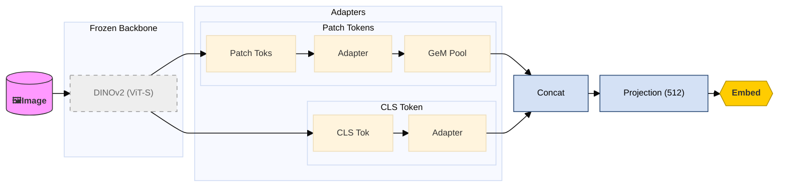
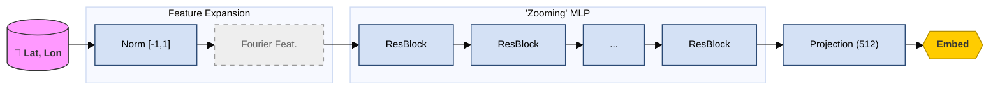
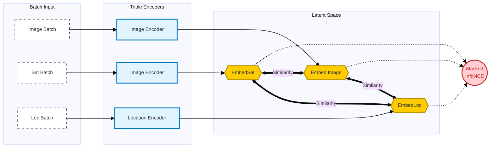

# 🥐🗼 Position Guessr   

**Authors**: Alexandre DUCROS, Nabil HAMOUDI

## 📝 Overview

**Position Guessr** is a Deep Learning project aiming to retrieve the precise geographical coordinates (latitude, longitude) of a location based on a street-level photograph.

We focus on geolocalisation in the Parisian Region, but France is supported using an appropriate dataset.

Inspired by the [GeoCLIP](https://arxiv.org/abs/2309.16020) architecture, our model aligns visual features (from streetview images and satellites images) with spatial features (coordinates) using Contrastive Learning.

## For an even quicker start :

Use our [google colab demo](https://colab.research.google.com/drive/1z9V7xi33NAnsBgNWSKV_DYNNnzjHAKVb?usp=sharing) ! It has a dataset downloaded, a trained model, generated embeddings. Life is good !

## ⚙️ Installation

### Requirements

- Python 3.13+ (Tested, 3.11+ might work)
- CUDA-capable GPU (Recommended for training)
- Pytorch installed

#### Essential dependencies (other than Pytorch)

> torchvision numpy matplotlib opencv-python albumentations random-fourier-features-pytorch geopy gdown

#### Scraping dependencies

> streetlevel py360convert

### Quick Start

Please adapt the "python" prefix with yours.

Clone the repository and install the dependencies :

```sh
python -m pip install tqdm torchvision numpy matplotlib opencv-python albumentations random-fourier-features-pytorch geopy gdown
```

Benchmark a model :

```bash
python download_data.py download --type dataset paris_1k
python download_data.py download --type model paris_50k
python download_data.py download --type embeddings paris_50k
python download_data.py download --type coordinates paris_50k

#Finally
python main.py benchmark ./model_paris_50k.pt ./coordinates_paris_50k.json ./embeddings_paris_50k.pt ./datasets/paris_1k --cross
```

Train a model :

```bash
python download_data.py download --type dataset paris_1k
python .\main.py train 10 32 ./datasets/paris_1k
```

## 🚀 Usage

The project is designed to be run through CLI, here it is `main.py`.

Across the CLI the `--cross` (or `-c`) option is to use the cross-view model, note that you then need a dataset with satellite views. The `--france` (or `-f`) option is to tell the model that you are in a national context and not focused on Paris.

#### 0. Downloading data

Please use download_data.py to retrieve datasets, pretrained models and pretrained embeddings.

```python
python download_data.py [-h] {list,download}

# Example (Get the list of downloadable objects)
python download_data.py list

# Example (Downloading Paris 1K) 
python download_data.py download --type dataset paris_1k

# Example (Downloading Paris 50K pre-trained model)
python download_data.py download --type model paris_50k
```

#### 1. Training

To train the model on a specific dataset. Use `batch_combined` (or `bc`) to simulate large batches on limited VRAM. Note that it still use heavy amount on VRAM and that 12 to 16Gb are recommended to train the model.

```
python main.py train [-bc BATCH_ACCUMULATION] <epochs> <batch_size> <dataset_path>

# Example (Training the Base Model)
python main.py train -bc 256 150 32 ./dataset/paris

# Example (Training the Cross View Model)
python main.py train -bc 256 150 32 ./datasets/paris_1k --cross
```

#### 2. Inference & Visualisation

```bash
python main.py get_closest [-c] [-fr] model_path embed_path image_path coordinates_path #Inference
python main.py gen_gallery [-c] [-fr] model_path dataset_folder #Embed database generation
python main.py placehold for Visualisation
python main.py --help #To get infos about other commands, can also be applied to commands

#Inference example using cross-view
python main.py get_closest -c model_paris_50k.pt embeddings_paris_50k.pt ./test_img.jpg ./dataset/coordinates.json
```

## 📂Project Structure

```
Position Guessr
├── main.py                     # CLI Entry point
├── src/
│   ├── base/                   # Standard Model (Image <-> Location)
│   │   ├── dataset.py
│   │   ├── model.py
│   │   └── train_base.py
│   │
│   ├── cross_view/             # Cross-View Model (+ Satellite)
│   │   ├── dataset_cross.py
│   │   ├── model_cross.py
│   │   └── train_cross.py
│   │
│   ├── model_components/       # Shared Architectures
│   │   ├── image_encoder.py    # DINOv2 backbone + Adapters
│   │   └── location_encoder.py # RFF + ResMLP
│   │
│   ├── embed_database.py       # Embedding generation & Visu
│   ├── training_utils.py       # Loss function & Dataset splitting
│   ├── validation_utils.py     # Validation execution
|   └── visu_spider.py          # Spider thread like visualisation of predicted position
|   
│
└── dataset/                    # Data storage
    ├── coordinates.json        # Labels and Metadata
    ├── img/                    # Street View Images
    └── sat/                    # Satellite Images (Optional, obligatory for cross-view)
```

## 🧠 Methodology

Our approach relies on **Deep Metric Learning**:

1. **Image Encoder:** We use **DINOv2 (Small)** frozen weights with trainable adapters to extract semantic features from streetview images and satellite images.
2. **Location Encoder:** We use **Random Fourier Features (RFF)** to map 2D GPS coordinates into a high-dimensional space. The encoder is then used as a **Neural Feature Field**, enabling the model to learn high-frequency spatial details rather than smooth global trends.
3. **Loss Function:** We utilize a **Masked InfoNCE Loss**.
   * It maximizes similarity between an image and its location.
   * It treats physically close locations (e.g., < 10m) as valid positives (masking) to avoid false negatives during contrastive learning.

You can learn more about the architecture in "model_explained.ipynb" or online [here](https://colab.research.google.com/drive/1VPylq210Usa3KIG8PUrhk0AHZs1yfn7l?usp=sharing) !

Here are the main two main diagrams :





The learning can be summarized as :



## 💾 Datasets

> Our data is scraped from Google Street View. Each dataset must contain a `coordinates.json` file and an image folder. We pick random coordinates in certain places and use the library *streetlevel* to get the Google Panorama ID and image.
> Satellite images are collected using IGN API.

### Available Datasets

* **France 50K :** 50k images, data is randomized but centered around 50 cities. [Download](https://drive.google.com/file/d/1VElOIWDLL83oL-OrIfO-i7G07vkbTfpn/view?usp=sharing)
* **France 300K :** 300k images randomized across the country. [Download](https://drive.google.com/file/d/1PQ7r9Ijj5XKESN2vsECv_YgFcfE7xzAh/view?usp=sharing)
* **Paris 50K :** 50K images randomized across the Parisian Region (includes Satellite views). [Download](https://drive.google.com/file/d/1Ht602iXoHgHuJ9hNJh9biDCdQwxGDzPH/view?usp=drive_link)
* **Paris 100K :** Using Paris 50K as a base we added 50K more image (also includes Satellite views). [Download](https://drive.google.com/file/d/1_J98Wfn-7yjhDlurKxnA5QkM0dTYcKUS/view?usp=sharing)
* **Paris 1K :** 1K image of the Parisian Region, can be used as a test set for benchmarking or as quick way to test training. It has been sampled independently from other datasets. [Download](https://drive.google.com/file/d/1ulp6vD-rpDRm-rYo6CirefnI23k5ZImk/view?usp=sharing)

Note that Paris 50K/100K datasets, models and embeddings are trained/generated using satellite images and then need the `--cross` (or `-c`) option in the CLI.And that the France datasets needs the `--france` (or `-f`) option in the CLI.

> Every dataset folder indeed needs to have a coordinates.json (detailed below), a folder named "img" where the streetview images are and optionally a "sat" folder where the corresponding satellite images goes.
> The id should be shared across the folders (even if the prefix_ is not the same).

```js
 "img_id" : {
    "longitude": float, // Longitude in EPSG:4326 system
    "latitude": float, // Latitude in EPSG:4326 system
    "pano_id": string, // ID of the streetview panorama
    // other keys are not necessary for current models to run.
}
```

## 🤖 Models

Paris 50K model we stopped early : [Download](https://drive.google.com/file/d/1tcvvOx-qeKgNDOw9BItXGN3eOlYzIB1_/view?usp=sharing)

Paris 100K model : [Download](https://drive.google.com/file/d/1UjKgMk25QQ4ZrZUajCCcrtnj9NNXNq3v/view?usp=sharing)

## 📊 Results

We trained the Cross View model on Paris 100K and on Paris 50K. We used a LR of 1e-4 except for the logit_scale where we used 1e-3, with a batch size of 32 and an accumulated batch size of 600, taking around 14Gb of VRAM.
Both models were stopped early due to time constraints (as full training takes us 20 hours), but gives a rough estimate on how a fully trained model could work.

For the Paris 100K model, we get the following training curve :


For training the kNN is done between position embeds and image embeds only between the elements within the validation set.
The Recall strategy takes the point with the best similarity.

A benchmark run with the same Recall strategy using Paris_1k as the test set gives :

> **Mean Error**        : 3045.69 m
> **Median Error**      : 141.47 m
>
> **Precision @ 10km**  : 87.50%
> **Precision @ 2km**  : 66.50%
> **Precision @ 1km**  : 61.40%
> **Precision @ 500m**  : 57.90%
> **Precision @ 200m**  : 52.20%
> **Precision @ 100m**  : 47.20%
> **Precision @ 25m**  : 30.40%

The difference between the Mean Error and the Median Error can be interpreted as the confusion of the model : when he knows he can pinpoint the location, but when he don't he can't pinpoint a good heuristic. This argument can be taken further by using the same benchmark run but using a Recall strategy where we take the closest point within the 5 closest (which is not usable in a real use case) :

> **Mean Error**    : 990.55 m
> **Median Error**  : 50.72 m
>
> **Precision @ 10km**  : 98.40%
> **Precision @ 2km**  : 85.60%
> **Precision @ 1km**  : 77.80%
> **Precision @ 500m**  : 72.20%
> **Precision @ 200m**  : 65.30%
> **Precision @ 100m**  : 59.00%
> **Precision @ 25m**  : 35.60%

Mean Error is a lot closer to what one can expect, and the model Recall curve is a lot smoother.
This actually gives a motivation to create heuristics about what point one should take from the kNN, as it may boost stability at a minimal performance cost.

## 🔮 What is next ?

We would like to get the model working on the uniform France dataset, which will need at least satellite views as the problem is a lot harder because of forest and tree.

We would also like to take time to fully train the models and to push Recall strategies further.

## 📚 References

- **GeoCLIP:** Vicente Vivanco Cepeda, Gaurav Kumar Nayak and Mubarak Shah (2023). *GeoCLIP: Clip-Inspired Alignment between Locations and Images for Effective Worldwide Geo-localization.*[arXiv:2309.16020](https://arxiv.org/abs/2309.16020)
- **DINOv2:** Oquab et al. (2023). *DINOv2: Learning Robust Visual Features without Supervision.*
